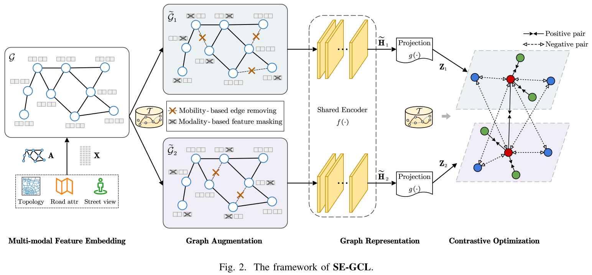

# SE-GCL: A Semantic-Enhanced Graph Contrastive Learning Framework for Road Network Embedding

:triangular_flag_on_post: This is the PyTorch implementation of our paper summited to **IEEE Conference on Data Engineering (ICDE) 2024**.



## 📚 Contents

- [File Structure](#-file-structure)
- [Quick Start](#-quick-start)
- [Performance and Visualization](#-performance-and-visualization)
- [Customize Your Own Dataset](#%EF%B8%8F-customize-your-own-dataset)
- [FAQ & Contact](#-faq--contact)


## 📁 File Structure

```python
│  config.py	       # hyper-parameter setting
│  model.py		# implementation of SE-GCL
│  requirements.txt
│  train.py		# train the SE-GCL model 
│
├─checkpoints 	# a empty folder for saving model checkpoints
├─data/Porto	       # a empty folder to place data
├─embeddings	       # a empty folder to store segment embeddings
│
├─preprocessing
│      road_network_download.py
│      road_network_processing.py
│      trajectory_processing.py
│      visual_feature_extraction.py
│
└─tasks
       road_type_classification.py
       traffic_speed_inference.py
       travel_time_estimation.py
```


## 📜 Quick Start

#### Requirements

- `pip install -r requirements.txt`
- Download the Porto dataset we processed and packaged in [Google Drive](https://drive.google.com/file/d/14yTivaV41gst0_k4ufHBHSV205tcRNqb/view?usp=drive_link), then unzip it to the empty folder `./data/Porto/`.

#### Self-supervised Training

> ***Note***: The trained SE-GCL and the corresponding learned embeddings are persisted to folder `./checkpoints/` and `./embeddings/`,  respectively.

```python
python train.py
```

#### Downstream Task Evaluation

```python
# evaulate on: ROAD TYPE CLASSIFICATION
python ./tasks/road_type_classification.py
# evaulate on: TRFFIC SPEED INFERECE
python ./tasks/traffic_speed_inference.py
# evaulate on: TRAVEL TIME ESTIMATION
python ./tasks/travel_time_estimation.py
```


## 💡 Performance and Visualization

<p float="left">
  
   
</p>


## 🛠️ Customize Your Own Dataset

To facilitate running the SE-GCL model on your own dataset, we also release the code for dataset preparation. Here, we give the following processing steps for reference (take the **Porto** dataset as an example):

1. Download the road network of Porto (See `./preprocessing/road_network_download.py`). The downloaded road network can be visualized via <https://kepler.gl/>, as shown in below:
   <div align=center>
   
   </div>

2. Extract the road segment attributes (i.e., id, length, longitude and latitude) and  prepare the data label for Road Type Classification task (See `./preprocessing/road_network_processing.py`). 

3. Download the raw trajectory data of Porto: <https://www.kaggle.com/c/pkdd-15-predict-taxi-service-trajectory-i>

4. Process the raw trajectory data named `train.csv` of Porto. This step includes: data cleaning, map matching, calculation of co-occurrence matrix and road speed labels, and dataset preparation for Travel Time Estimation task (See in `./preprocessing/trajectory_processing.py`). For your convenience, we also list some popular map matching algorithms:

   - Fast Map Matching (FMM): <https://fmm-wiki.github.io/>
   - ST-Matching: <https://github.com/rottenivy/ST-Matching>
   - L2MM (our previous work): <https://github.com/JiangLinLi/L2MM>

5. Download street-view images from Google Maps.

6. Extract visual features from street-view images (See in `./preprocessing/visual_feature_extraction.py`). 


## 📌 FAQ & Contact

- Due to the Didi company's data pact, we cannot publish the original or other data of Chengdu.

Any inquiries feel free to contact <csjiezhao@gmail.com>.

